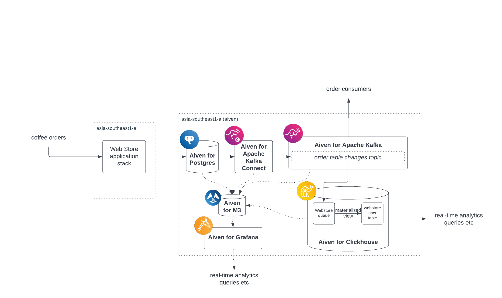

# Create CDC Pipeline with Aiven

This is the code repository behind the DOTC Keynote Building an End to End Data Pipeline. 
PRs / Issues are welcome if you find something here that isn't to your liking :) 

## Pre-requisites 
* An [Aiven Account](#create-your-aiven-account) 
* The [Aiven CLI](https://docs.aiven.io/docs/tools/cli.html) installed
* A text editor of your choice
* This github repository cloned 
* psql commandline (or maybe something like [pgadmin](https://www.pgadmin.org/download/) installed)
* A curious mind.. 

> Install the AVN CLI from the instructions [here](https://docs.aiven.io/docs/tools/cli.html).

And this is what we are going to build... 



Sounds too good to be true? 
Welcome to Aiven :) 

## Create your Aiven Account
If you haven't already done this, create a new Aiven trial at the [signup page](https://console.aiven.io/signup). 


Here's how easy it is to get started with a trial in Aiven.

https://user-images.githubusercontent.com/768991/192938791-98effa95-d40f-4c32-b0a1-82752131f6f9.mp4

Done? Awesome, let's start creating the databases we are going to need. 

## Create Postgres

Click on the `create service` button to get started with your new Postgres service. 

https://user-images.githubusercontent.com/768991/192938883-949af89b-a75d-44e3-8b80-7228aaaace53.mp4


Once your postgres service is up and running, we need to connect and configure the database for the following sections.

Get your credentials from the Postgres service in Aiven 


Note your connection string. 


### Setup The CDC Configuration
The Aiven Postgres service will require some [setup in the database](https://docs.aiven.io/docs/products/kafka/kafka-connect/howto/debezium-source-connector-pg.html) we have just created.

You will need to install the aiven-extras extenstion and create a publication for all the tables.

First, connect to your postgres service
```console
$ psql <YOUR CONNECTION STRING>
```

> Be sure to remove the ?sslmode parameter when using the psql from local machine

Then, create the [aiven_extras](https://github.com/aiven/aiven-extras) postgres database extension
```sql
CREATE EXTENSION aiven_extras CASCADE; 

SELECT *
FROM aiven_extras.pg_create_publication_for_all_tables(
    'debezium_publication',
    'INSERT,UPDATE,DELETE'
    ); 
```

### Adding Data

Now, let's create our data table and load some data.

```console
$> psql <'SERVICE_URI_FROM_CONSOLE'> -f sql/create.sql
psql:sql/create.sql:1: NOTICE:  table "orders" does not exist, skipping
DROP TABLE
CREATE TABLE

$> psql <'SERVICE_URI_FROM_CONSOLE'> -f sql/insert.sql
```

Excellent, we know have our postgres database loaded with data. 

Let's move to the next step.

## Create Kafka


Click on the `create service` button to get started with your new Kafka service. 

https://user-images.githubusercontent.com/92002375/192944203-83e29756-90c1-481e-beba-13a2fe876f82.mp4

After creating the Kafka service, go to the `service overview` page and enable `Apache Kafka REST API (Karapace)` and the `Schema Registry (Karapace)`

Next, scroll down to `Advanced Configurations` and add in `kafka.auto_create_topics_enable`. Turn the configuration on and save advanced configuration. 


## Create Kafka Connect 

Go to your Kafka service overview page, `manage integrations`, and select `Kafka Connect` to get started! 

https://user-images.githubusercontent.com/92002375/193548233-7d6f6797-ab78-4e71-9037-65f00d50ae3f.mp4

ƒ
## Create Debezium Connector

https://user-images.githubusercontent.com/92002375/193753962-7124b560-8cf6-4173-8afa-a49586a82434.mp4

Go to Kafka service overview page > `manage integrations` > `Kafka connect`

Once your Kafka Connect service has completed building you then can create the Debezium - PostgreSQL Source connection. 
For this you will need to use the AVN CLI 

> Install the AVN CLI from the instructions [here](https://docs.aiven.io/docs/tools/cli.html).  This configuration is also possible using the Console UI

```console
> avn service connector create <YOUR KAFKA CONNECT SERVICE NAME> '{
    "name": "kafka-pg-source-conn",
    "transforms": "extractState",
    "connector.class": "io.debezium.connector.postgresql.PostgresConnector",
    "tasks.max": "1",
    "key.converter": "org.apache.kafka.connect.json.JsonConverter",
    "database.server.name": "dotc-service-pg",
    "database.hostname": "<YOUR PG HOST>",
    "database.port": "<YOUR PG PORT>",
    "database.dbname": "defaultdb",
    "database.user": "avnadmin",
    "database.password": "<YOUR PG PASS>",
    "value.converter": "org.apache.kafka.connect.json.JsonConverter",
    "plugin.name": "pgoutput",
    "slot.name": "debezium",
    "publication.name": "debezium_publication",
    "decimal.handling.mode": "string",
    "database.sslmode": "require",
    "include.schema.changes": "false",
    "key.converter.schemas.enable": "false",
    "value.converter.schemas.enable": "false",
    "transforms.extractState.type": "io.debezium.transforms.ExtractNewRecordState"
}'
```
Modify the JSON file with connection information from your `PostgreSQL service`. You can get your connection information by going to your PostgreSQL service overview tab.

## Send Data From PostgreSQL to Kafka 

https://user-images.githubusercontent.com/92002375/194475453-39cefaf3-2b25-4546-bdbe-c1f6f3f281ab.mp4

Time to load a whole load of orders into your database. You can run this as many times as you want ! 
```console
psql <YOUR PG CONNECTION STRING> -f sql/insert.sql
```

Go to your Kafka topic, messages and select fetch messages. Decode the message and observe that the data that you inserted to PostgreSQL shows up on Kafka. 

With that, you are done with your PostgreSQL and Kafka setup! Next, let's explore how to create a `Clickhouse` service. 


## Create Clickhouse


https://user-images.githubusercontent.com/92002375/194501434-6a2f743a-37cf-4502-81d3-a00e1574c336.mp4


## Configure Kafka -> Clickhouse


https://user-images.githubusercontent.com/92002375/194501462-c12ae651-120f-4fc2-8c8f-e664c9ee1f75.mp4


## Consume The Data Stream

So our last step is now to setup some tables in Clickhouse so the data in the Kafka topic is getting consumed. From the drawing at the start of our session you will see there are two Clickhouse tables we need to create, as well as a Clickhouse Materialised View. The reason we do this is because once you read data from the Kafka topic in Clickhouse, you advance the Consumer offset and so it is effectively a "query once only" behaviour in Clickhouse. So, we use that query to load data into a different table that allows user queries for analytics. 

You will find the topic name in your Kafka configuration, under the topics tab. 

> Clickhouse is still in beta so the only way for us to operate with the Clickhouse - Kafka integration today is via the AVN CLI client. You can install the AVN CLI from the instructions [here](https://docs.aiven.io/docs/tools/cli.html). 

Firstly, lets make sure we know the name of the topic that has been created in Kafka as a result of the Kafka Connect configuration. We require this so we can tell Clickhouse what topic to read the data from. 

```console
$> avn service integration-list dotc-clickhouse
SERVICE_INTEGRATION_ID                SOURCE                    DEST                      INTEGRATION_TYPE       ENABLED  ACTIVE  DESCRIPTION                                                                     
====================================  ========================  ========================  =====================  =======  ======  ================================================================================
(integration not enabled)             dotc-clickhouse     dotc-service-kafka  kafka_logs             false    false   Send service logs to Aiven Apache Kafka service or external Apache Kafka cluster
00b2961a-ae30-47c5-bc58-782ef67e0792  dotc-service-kafka  dotc-clickhouse     clickhouse_kafka       true     true    Access a Kafka cluster from ClickHouse
(integration not enabled)             dotc-service-pg     dotc-clickhouse     clickhouse_postgresql  false    false   Access a PostgreSQL database from ClickHouse
```

Now we can take that integration id and insert into this command. 
Be sure to update the `topics` element and the end of this command with the topic from your service if you have modified any of the default settings.

```console
avn service integration-update <YOUR CLICKHOUSE INTEGRATION ID>  \
    --project <YOUR AIVEN PROJECT> \
    --user-config-json '{
    "tables": [
        {
            "name": "orders_queue",
            "columns": [
                {"name": "id" , "type": "Int64"},
                {"name": "first_name" , "type": "String"},
                {"name": "last_name" , "type": "String"},
                {"name": "email" , "type": "String"},
                {"name": "gender" , "type": "String"},
                {"name": "street" , "type": "String"},
                {"name": "town" , "type": "String"},
                {"name": "mobile" , "type": "String"},
                {"name": "country" , "type": "String"},
                {"name": "drink_type" , "type": "String"},
                {"name": "cost" , "type": "String"},
                {"name": "addons" , "type": "String"},
                {"name": "comments" , "type": "String"}
            ],
            "topics": [{"name": "dotc-service-pg.public.orders"}],
            "data_format": "JSONEachRow",
            "group_name": " order_consumer"
        }
    ]
}'
```

Now we can create the Clickhouse tables, the scripts for this are in the `sql/ch-create.sql` file 

Open the Clickhouse service in the Aiven Console and look for the query editor. 

Create the Table
```sql
CREATE TABLE default.orders
(
    id String,
    first_name String,
    last_name String,
    email String,
    gender String,
    street String,
    town String,
    mobile String,
    country String,
    drink_type String,
    cost Float32,
    addons String,
    comments String
) ENGINE = MergeTree ORDER BY (id);
```

Create the Materialised View
```sql
CREATE MATERIALIZED VIEW default.orders_mv TO default.orders AS 
SELECT id, first_name, last_name, email, gender, 
            street, town,  mobile, country, drink_type, 
            toFloat64OrZero(cost) as cost, addons, comments
FROM `service_dotc-service-kafka`.orders_queue;
```

Now, you should be able to determine the most popular drink in Singapore!! 
```sql
select count(*) c, drink_type from default.orders group by drink_type order by c desc;
```


# Bonus Marks!! 
Did you make it to the end already? Still have time left in our workshop? Well done, I told you Aiven was simple and easy to use didn't I! :) 

You can now have a go at 
[Adding an Observability Stack](#create-observability-stack)
OR 
[Build This Again Using Terraform](#build-this-again-using-terraform)


## Create Observability Stack
https://user-images.githubusercontent.com/92002375/194501746-d95575d4-acf2-48b1-949b-c8d85563509b.mp4

The Aiven platform comes with the capability of spinning up observability pipelines with a few clicks of a button. Follow the video and try it out!

## View Observability Stack


https://user-images.githubusercontent.com/92002375/194501920-89e54eb0-09df-4056-aa90-9e47166ea1eb.mp4

Spinning up an observability stack comes with pre-populated panels that you can use immediately to monitor your services. 


## Build This Again Using Terraform

You can also interface with Aiven's platform through Infrastructure-As-Code such as [Terraform](https://registry.terraform.io/providers/aiven/aiven/latest/docs) or [Kubernetes](https://docs.aiven.io/docs/tools/kubernetes.html). We have provided example terraform scripts in the `./terraform` directory. 

To execute simply
```console
$> cd terraform
$> terraform plan
$> terraform apply
```
